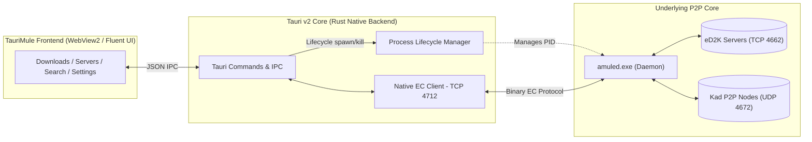
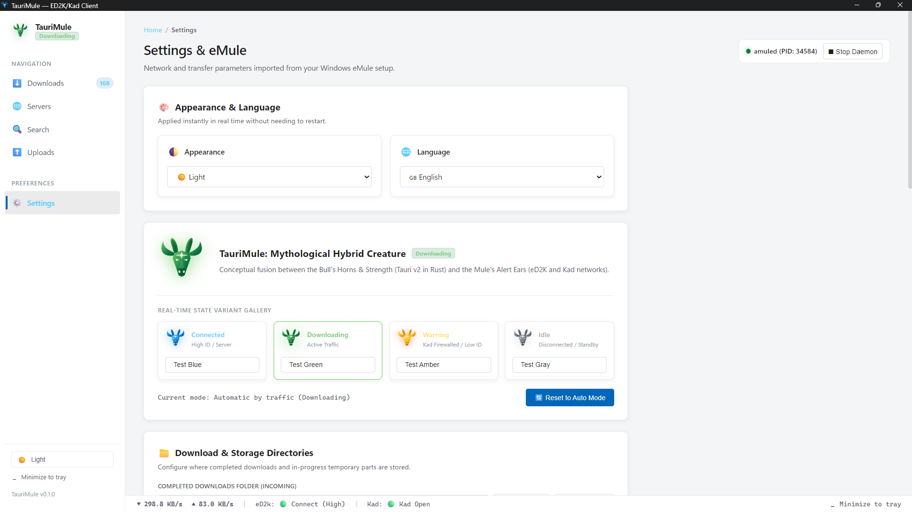
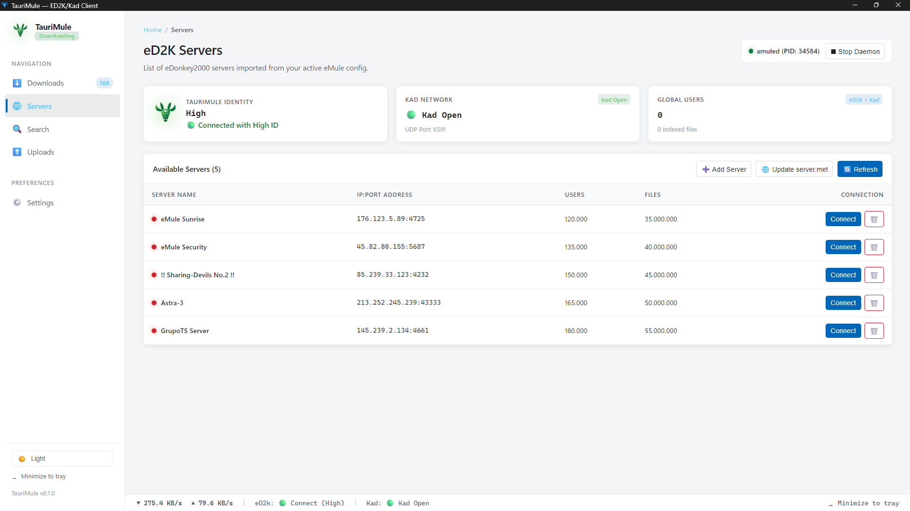
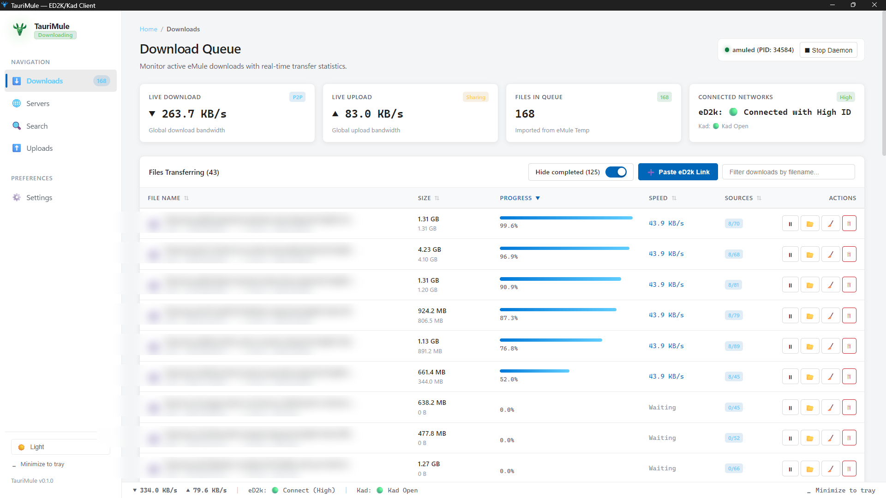
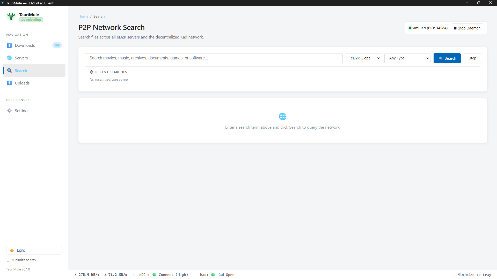
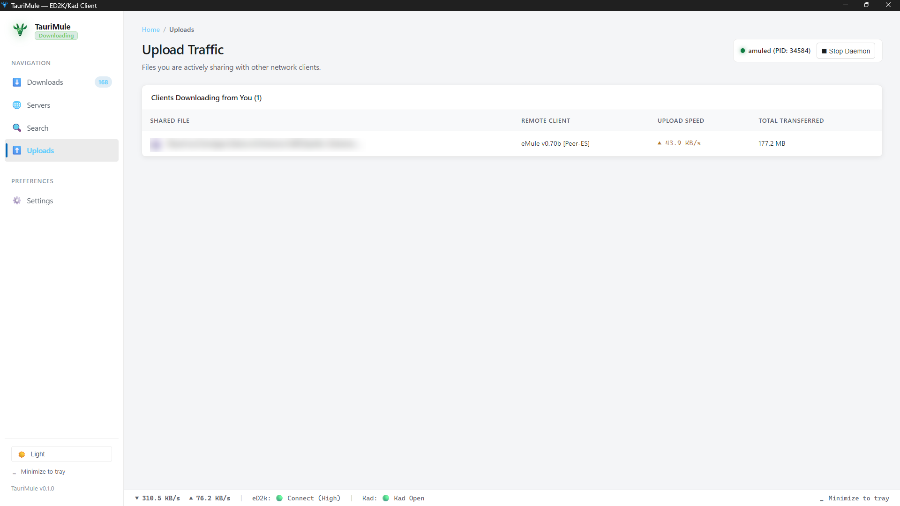

# ⚡ TauriMule — User Manual & Operating Guide

Welcome to the **TauriMule User Manual**. This comprehensive guide provides step-by-step instructions, workflows, network setup advice, and troubleshooting tips for operating TauriMule on Windows.

> **Language**: [English (Current)](MANUAL.md) • [Español (Spanish)](MANUAL_ES.md)

---

## Table of Contents

1. [Introduction & Architecture](#1-introduction--architecture)
   - [What is TauriMule?](#what-is-taurimule)
   - [The Core Engine: aMule Daemon (`amuled`)](#the-core-engine-amule-daemon-amuled)
   - [Dynamic Stateful Mascot (Network Status Indicator)](#dynamic-stateful-mascot-network-status-indicator)
2. [Installation & First Launch](#2-installation--first-launch)
   - [Installer (.exe / .msi) vs. Portable (.zip)](#installer-exe--msi-vs-portable-zip)
   - [The Startup Daemon Synchronization Screen](#the-startup-daemon-synchronization-screen)
3. [Initial Setup & Preferences](#3-initial-setup--preferences)
   - [Clean Setup: Defining Incoming & Temporary Folders](#clean-setup-defining-incoming--temporary-folders)
   - [Importing Configuration from Existing eMule / aMule](#importing-configuration-from-existing-emule--amule)
   - [Appearance & Dark/Light Themes](#appearance--darklight-themes)
   - [Interface Languages (i18n)](#interface-languages-i18n)
4. [Connecting to Networks: eD2K & Kad](#4-connecting-to-networks-ed2k--kad)
   - [Understanding High ID vs. Low ID](#understanding-high-id-vs-low-id)
   - [Port Forwarding & Windows Firewall (TCP 4662 / UDP 4672)](#port-forwarding--windows-firewall-tcp-4662--udp-4672)
   - [Managing eD2K Servers](#managing-ed2k-servers)
   - [Updating `server.met` from URL](#updating-servermet-from-url)
   - [Bootstrapping the Decentralized Kademlia (Kad) Network](#bootstrapping-the-decentralized-kademlia-kad-network)
5. [Managing Downloads](#5-managing-downloads)
   - [Queue Overview & Real-Time Bandwidth](#queue-overview--real-time-bandwidth)
   - [Fluent Toggle Switch: Show/Hide Completed Downloads](#fluent-toggle-switch-showhide-completed-downloads)
   - [Column Sorting & Prioritization](#column-sorting--prioritization)
   - [Pasting eD2K Links (Single & Batch Download)](#pasting-ed2k-links-single--batch-download)
   - [Smart Filename Cleaner & Diff Preview](#smart-filename-cleaner--diff-preview)
   - [Opening Completed Files & Enclosing Folders](#opening-completed-files--enclosing-folders)
6. [Multi-Tab P2P Search & History](#6-multi-tab-p2p-search--history)
   - [Search Networks & Filter Categories](#search-networks--filter-categories)
   - [Multi-Tab Results Navigation](#multi-tab-results-navigation)
   - [Search History Memory with Individual Deletion](#search-history-memory-with-individual-deletion)
7. [Upload Traffic & The P2P Credit System](#7-upload-traffic--the-p2p-credit-system)
   - [Monitoring Active Uploads](#monitoring-active-uploads)
   - [How the eMule/aMule Credit System Works](#how-the-emuleamule-credit-system-works)
8. [System Tray & Daemon Management](#8-system-tray--daemon-management)
   - [Minimizing to Tray](#minimizing-to-tray)
   - [Stopping & Restarting `amuled`](#stopping--restarting-amuled)
9. [Troubleshooting & Frequently Asked Questions (FAQ)](#9-troubleshooting--frequently-asked-questions-faq)
10. [Legal Disclaimer & User Responsibility](#10-legal-disclaimer--user-responsibility)

---

## 1. Introduction & Architecture

### What is TauriMule?
**TauriMule** is a modern, lightweight, high-performance desktop interface built specifically for Windows. It provides a contemporary, fluent user experience for the eDonkey2000 (eD2K) and Kademlia (Kad) peer-to-peer file sharing protocols.

Traditionally, users were stuck with legacy interfaces dating back to 2002. TauriMule retains the proven stability of the underlying aMule core while completely replacing the user interface with a modern stack built on **Tauri v2**, **Rust**, **TypeScript**, and **Microsoft Fluent Design**.

### The Core Engine: aMule Daemon (`amuled`)
TauriMule itself is strictly a Graphical User Interface (GUI). It does not contain custom networking code that handles P2P file transfers directly; instead, it manages an embedded instance of `amuled.exe` (the official headless aMule daemon).

- **IPC Protocol**: Communication between TauriMule and `amuled` occurs locally over the **External Connection (EC) protocol** via localhost TCP port `4712`.
- **Zero Heavy Overhead**: The frontend uses minimal RAM (~45 MB), allowing low-spec PCs to download continuously without bogging down system memory.

### Dynamic Stateful Mascot (Network Status Indicator)
In the top-left sidebar, TauriMule displays a responsive mascot that reacts in real-time to your network state:

| Status Icon | State | Meaning |
| :---: | :---: | :--- |
|  | **Connected (Blue)** | Connected to an eD2K server with a High ID. Ready for peak download speeds. |
|  | **Downloading (Green)** | Active data download is in progress across eD2K or Kad sources. |
|  | **Warning (Amber)** | Low ID or Kad Firewalled. Ports may need router forwarding. |
|  | **Idle / Disconnected (Gray)** | Disconnected from networks or waiting for connection. |

---

## 2. Installation & First Launch

### Installer (.exe / .msi) vs. Portable (.zip)
TauriMule is distributed in three formats via [GitHub Releases](https://github.com/alexwing/Taurimule/releases):

1. **Setup Installer (`TauriMule_0.1.0_x64-setup.exe` or `.msi`)**:
   - Recommended for standard desktop use.
   - Installs to `%LOCALAPPDATA%\TauriMule`.
   - Creates Start Menu shortcuts and registers system protocols.
2. **Portable ZIP (`TauriMule_0.1.0_x64_portable.zip`)**:
   - Recommended for portable drives or running without administrative privileges.
   - Extract anywhere and run `TauriMule.exe` directly.

### The Startup Daemon Synchronization Screen
When you launch TauriMule, the application checks whether the `amuled` daemon is running. If not, it automatically boots the daemon in the background.

During this 2-4 second initialization window:
- A clean **"Connecting to aMule Core..."** splash modal appears.
- It prevents premature user interaction while `amuled` validates its internal index (`known.met`), loads server lists, and opens the local EC port `4712`.
- Once connected, the download queue and stats load seamlessly.

---

## 3. Initial Setup & Preferences

  
   
  <em>Figure 1: Settings panel showing Theme, Language, Mascot state gallery, and Storage Directories.</em>

Navigate to **Settings** (`⚙️`) in the left sidebar to configure your environment.

### Clean Setup: Defining Incoming & Temporary Folders
On a fresh installation without existing eMule configurations, you must configure where downloaded files and temporary part files are stored:

1. In the **Download & Storage Directories** card:
   - **Completed Downloads Folder (Incoming)**: The final directory where completed files are moved (e.g., `D:\Downloads\eMule Incoming`).
   - **Temporary Parts Folder (Temp)**: The scratch disk folder where in-progress `.part` and `.part.met` files live during transfer (e.g., `D:\Downloads\eMule Temp`).
2. Click **Save Storage Paths** to immediately apply the changes to `amule.conf`.

> [!TIP]
> Ensure your Temporary folder has sufficient free disk space to allocate full file reservations, especially when downloading high-definition videos or large archives.

### Importing Configuration from Existing eMule / aMule
If you already have a working Windows eMule installation (e.g. at `C:\Program Files\eMule` or `%APPDATA%\eMule`), TauriMule can import your settings with one click:

1. Click **Import from eMule** in the Settings panel.
2. TauriMule will automatically detect and import:
   - `server.met` (Your curated server list).
   - `nodes.dat` (Your Kad network contacts).
   - `preferences.ini` (Bandwidth limits, port assignments, and user nickname).
   - `cryptkey.dat` & `preferences.dat` (Your User Hash to retain peer credits).
   - `known.met` & `cancelled.met` (Known downloaded file hashes).

### Appearance & Dark/Light Themes
TauriMule includes both **Light** and **Dark** themes built using Microsoft Fluent design guidelines:
- Select **Light** or **Dark** in Settings, or click the quick theme button at the bottom of the sidebar.
- Theme switching is instantaneous and requires no restart.

### Interface Languages (i18n)
TauriMule is fully internationalized. Switch between:
- 🇪🇸 **Español**
- 🇬🇧 **English**
- 🇫🇷 **Français**
- 🇩🇪 **Deutsch**

---

## 4. Connecting to Networks: eD2K & Kad

  
   
  <em>Figure 2: eD2K Server list with connection controls, user stats, and server.met updater.</em>

TauriMule connects to two simultaneous networks:
1. **eD2K (eDonkey2000)**: A server-coordinated network that tracks file indexes and client lists.
2. **Kad (Kademlia)**: A 100% decentralized, serverless network where each client acts as a node.

### Understanding High ID vs. Low ID
Your ID status determines how easily other peers can connect to you:
- **High ID (🟢 Connected with High ID)**: Your client is directly reachable on the internet via your forwarded TCP port. You can download from and upload to all clients (both High ID and Low ID peers).
- **Low ID (🟡 Low ID / Firewalled)**: Other clients cannot initiate connections to you. You can only connect to High ID clients, significantly reducing available sources and download speeds.

### Port Forwarding & Windows Firewall (TCP 4662 / UDP 4672)
To achieve High ID and an Open Kad status:
1. **Windows Firewall**: TauriMule automatically adds firewall rules during installation. If prompted by Windows Defender, select **Allow Access** on Private Networks.
2. **Router NAT Port Forwarding**: Access your home router configuration (`192.168.1.1`) and forward:
   - **TCP Port 4662** to your PC's local IP address.
   - **UDP Port 4672** to your PC's local IP address.
   - **UDP Port 4665** (Optional, for extended server queries).

### Managing eD2K Servers
On the **Servers** page:
- View the active server list with server name, IP:Port, online users, and indexed files.
- Click **Connect** on any server to switch to it.
- Click **Disconnect** to close server connections.
- Click **Add Server** to manually enter a trusted IP, port, and description.

### Updating `server.met` from URL
To refresh your server list with active, safe servers:
1. Click **Update server.met**.
2. Paste a trusted `server.met` URL (e.g. from HispaMula or Peerates).
3. Click **Update**. TauriMule will download the list and merge it into your active servers.

### Bootstrapping the Decentralized Kademlia (Kad) Network
If Kad displays `Disconnected` or `Off`:
- As soon as you connect to an eD2K server and start downloading a file with active sources, Kad will automatically bootstrap from those peers.
- Alternatively, load a valid `nodes.dat` into your configuration folder.

---

## 5. Managing Downloads

  
   
  <em>Figure 3: Active downloads queue with live transfer rates, progress bars, and the completed items toggle.</em>

### Queue Overview & Real-Time Bandwidth
The **Downloads** page provides real-time statistics:
- **Live Download & Upload counters**: Instantaneous transfer rates updated every 2 seconds.
- **Files in Queue**: Total files being handled by the engine.
- **Connected Networks**: Current eD2k ID status and Kad network state.

### Fluent Toggle Switch: Show/Hide Completed Downloads
TauriMule features an integrated switch above the download table:
- **Default State**: Completed downloads are hidden (`Hide completed (N)` is active) to keep your workspace focused purely on in-progress transfers.
- **Toggling**: Click the switch anytime to reveal completed items in green status.
- **Persistence**: Your preference is saved locally and remembered across restarts.

### Column Sorting & Prioritization
Click any column header to sort:
- **FILE NAME**: Alphabetical sorting.
- **SIZE**: Sort by total file size.
- **PROGRESS**: Sort by completion percentage.
- **SPEED**: Sort by active transfer speed.
- **SOURCES**: Sort by transferring vs total sources (`transferring/total`).

Each row provides quick action buttons:
- `⏸ / ▶`: Pause or resume downloading.
- `📁`: Open enclosing folder in Windows File Explorer.
- `✏️`: Adjust priority (**Low**, **Normal**, **High**, or **Auto**).
- `🗑️`: Cancel and delete download from queue.

### Pasting eD2K Links (Single & Batch Download)
To download files directly from forum links or websites:
1. Click the **"+ Paste eD2k Link"** button above the download table.
2. Paste one or multiple `ed2k://|file|...|/` links into the text box.
3. The dialog automatically parses valid links, extracts filenames, calculates total batch size, and checks for duplicates.
4. Click **Download All** to add them to the queue.

### Smart Filename Cleaner & Diff Preview
Often, community eD2K links contain cluttered release names with tags like:
`Movie.Title.2024.1080p.HEVC.10b.Spa-Eng.by.ReleaseGroup.mkv`

TauriMule includes an automated **Filename Cleaner**:
- When adding links, click **Clean Names**.
- A **Diff Preview** displays the exact characters being cleaned.
- Removes scene tags, bracketed metadata, and resolution tags while safely preserving the file extension.

### Opening Completed Files & Enclosing Folders
When a download reaches 100%:
- Double-click the file row or click the folder icon (`📁`) to view the completed file in Windows Explorer.
- If it is a video, music, or document, you can launch it directly in your default Windows media player.

---

## 6. Multi-Tab P2P Search & History

  
   
  <em>Figure 4: Search screen with multi-network selectors, file categories, and recent search memory chips.</em>

### Search Networks & Filter Categories
On the **Search** screen, enter your query and configure the filters:
- **Search Scope**:
  - **eD2K Global**: Queries the global network of interconnected servers.
  - **Kad Network**: Directly queries the decentralized Kademlia distributed hash table (DHT).
  - **Local Server**: Queries only the server you are currently connected to.
- **File Type**: Any, Audio, Video, Image, Program, Archive, or Document.

### Multi-Tab Results Navigation
Unlike legacy eMule/aMule where starting a new search wiped out your previous results:
- **Dedicated Tabs**: Every new search query creates an **independent tab** with its own results counter (e.g. `[Stuart (14)] [Futurama (38)]`).
- **Retained Results**: You can browse, compare, and switch between searches without re-querying the network or losing previous findings.
- **Tab Close**: Close tabs individually by clicking the `✕` on the tab header.

### Search History Memory with Individual Deletion
TauriMule stores recent search terms as interactive chips below the search bar:
- Click any chip to restore that query and inspect its results.
- **Individual Deletion**: Each chip has a dedicated `✕` button to remove that specific entry from memory without affecting others.
- **Clear All**: Reset the entire history with one click.

---

## 7. Upload Traffic & The P2P Credit System

  
   
  <em>Figure 5: Upload traffic monitor displaying connected peers, transfer speeds, and transferred bytes.</em>

### Monitoring Active Uploads
The **Uploads** page displays all remote clients currently downloading file chunks from your shared files:
- **SHARED FILE**: The file being uploaded.
- **REMOTE CLIENT**: The client software and country/identification of the peer (e.g., `eMule v0.70b [Peer-ES]`).
- **UPLOAD SPEED**: Real-time bandwidth allocated to that peer.
- **TOTAL TRANSFERRED**: Cumulative bytes uploaded during the session.

### How the eMule/aMule Credit System Works
eMule networks operate on an official **Client Credit System**:
- When you upload data to another peer, that peer records a credit score for your User Hash (`cryptkey.dat`).
- Next time you request a file that this peer possesses, your credit rating advances your position in their upload queue.
- **Maintaining Uploads**: Keeping your upload active directly rewards your future download speeds across the network.

---

## 8. System Tray & Daemon Management

### Minimizing to Tray
TauriMule is designed to run quietly in the background:
- Click **"Minimize to tray"** in the sidebar or close button (if configured in Settings).
- TauriMule hides to the Windows Notification Area (System Tray), freeing your taskbar while continuing all active transfers.
- Double-click the tray icon to restore the window.

### Stopping & Restarting `amuled`
If you need to halt all network activity:
- In the top-right header, click **"■ Stop Daemon"**.
- TauriMule will gracefully disconnect from all servers, close open connections, and terminate the background `amuled` process safely to avoid corrupting `known.met` or `.part` files.
- To resume, click **"▶ Start Daemon"**.

---

## 9. Troubleshooting & Frequently Asked Questions (FAQ)

### Q1: Why do I have a "Low ID" or "Kad Firewalled"?
- **Cause**: Incoming connection requests on TCP port 4662 or UDP port 4672 are being blocked by your router or Windows Firewall.
- **Solution**:
  1. Check Windows Defender Firewall rules and ensure `TauriMule` and `amuled` are allowed.
  2. Open your router's administrative page and configure port forwarding for TCP 4662 and UDP 4672 to your computer's local IP address.
  3. Verify that your ISP does not put you behind CG-NAT (Carrier-Grade NAT). If they do, request a public IPv4 address or use Kad IPv6 if supported.

### Q2: Why are there no servers in the list on first launch?
- **Cause**: A clean installation does not include predefined servers.
- **Solution**: Navigate to **Servers**, click **"Update server.met"**, paste a reliable server list URL (such as `http://www.gruk.org/server.met` or HispaMula's URL), and click **Update**.

### Q3: Why does Kad show "Disconnected"?
- **Solution**: Kad requires at least one initial peer to discover the rest of the network. Connect to an active eD2K server, start any popular download, and Kad will automatically transition from `Connecting` to `Open` within a few minutes.

### Q4: The app shows "Waiting for aMule daemon to initialize..." and doesn't connect.
- **Solution**:
  1. Check Task Manager to see if an orphaned `amuled.exe` is already running on port 4712. If so, terminate it and restart TauriMule.
  2. Verify that your anti-virus software is not blocking `amuled.exe` located in the application directory.

---

## 10. Legal Disclaimer & User Responsibility

> [!WARNING]
> **TauriMule is strictly and exclusively a Graphical User Interface (GUI / Frontend).**
> - The underlying P2P network engine is official **aMule (`amuled`)**, communicating via standard local External Connection (EC) protocol on port 4712.
> - TauriMule and its author **DO NOT host, index, curate, track, or distribute any digital files or content.**
> - Neither this software nor its repository operates any eD2k servers, Kad nodes, or P2P infrastructure.
> - **The end user assumes sole and full legal responsibility** for any and all search queries, file transfers, or downloads, and must comply with intellectual property laws in their jurisdiction.
> - For full legal terms and liability limitations, please refer to [DISCLAIMER.md](DISCLAIMER.md) and [LICENSE](LICENSE).

---

  TauriMule is free and open-source software released under the <a href="LICENSE">GNU General Public License v3.0</a>.

