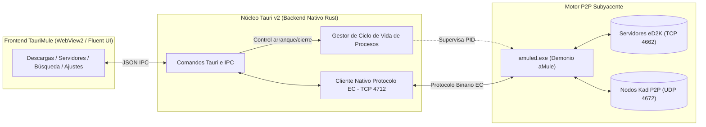

# ⚡ TauriMule — Manual de Usuario y Guía Operativa

Bienvenido al **Manual de Usuario de TauriMule**. Esta guía exhaustiva detalla paso a paso el funcionamiento, configuración de red, flujos de trabajo y resolución de incidencias de TauriMule para Windows.

> **Idioma**: [Español (Actual)](MANUAL_ES.md) • [English (Inglés)](MANUAL.md)

---

## Índice de Contenidos

1. [Introducción y Arquitectura](#1-introducción-y-arquitectura)
   - [¿Qué es TauriMule?](#qué-es-taurimule)
   - [El Motor Central: aMule Daemon (`amuled`)](#el-motor-central-amule-daemon-amuled)
   - [Mascota Reactiva y Estados de Red (Identidad Visual)](#mascota-reactiva-y-estados-de-red-identidad-visual)
2. [Instalación y Primer Arranque](#2-instalación-y-primer-arranque)
   - [Instalador (.exe / .msi) frente a Versión Portable (.zip)](#instalador-exe--msi-frente-a-versión-portable-zip)
   - [Pantalla de Sincronización y Espera del Demonio](#pantalla-de-sincronización-y-espera-del-demonio)
3. [Configuración Inicial y Preferencias](#3-configuración-inicial-y-preferencias)
   - [Instalación Limpia: Definir Carpetas de Descargas y Temporales](#instalación-limpia-definir-carpetas-de-descargas-y-temporales)
   - [Importar Configuración desde eMule o aMule Existente](#importar-configuración-desde-emule-o-amule-existente)
   - [Apariencia: Modo Claro y Modo Oscuro](#apariencia-modo-claro-y-modo-oscuro)
   - [Selector de Idiomas (i18n)](#selector-de-idiomas-i18n)
4. [Conexión a Redes: eD2K y Kademlia (Kad)](#4-conexión-a-redes-ed2k-y-kademlia-kad)
   - [Comprender High ID (ID Alta) frente a Low ID (ID Baja)](#comprender-high-id-id-alta-frente-a-low-id-id-baja)
   - [Apertura de Puertos y Firewall de Windows (TCP 4662 / UDP 4672)](#apertura-de-puertos-y-firewall-de-windows-tcp-4662--udp-4672)
   - [Gestión de Servidores eD2K](#gestión-de-servidores-ed2k)
   - [Actualizar lista de servidores (`server.met`) desde URL](#actualizar-lista-de-servidores-servermet-desde-url)
   - [Arranque y Conexión de la Red Descentralizada Kademlia (Kad)](#arranque-y-conexión-de-la-red-descentralizada-kademlia-kad)
5. [Gestión de Descargas](#5-gestión-de-descargas)
   - [Panel de Transferencias y Ancho de Banda en Tiempo Real](#panel-de-transferencias-y-ancho-de-banda-en-tiempo-real)
   - [Interruptor Fluent: Ocultar o Mostrar Descargas Completadas](#interruptor-fluent-ocultar-o-mostrar-descargas-completadas)
   - [Ordenación de Columnas y Prioridades](#ordenación-de-columnas-y-prioridades)
   - [Pegado de Enlaces eD2K (Descargas Individuales y por Lotes)](#pegado-de-enlaces-ed2k-descargas-individuales-y-por-lotes)
   - [Limpiador Inteligente de Nombres y Vista Previa (Diff)](#limpiador-inteligente-de-nombres-y-vista-previa-diff)
   - [Abrir Archivos Completados y Carpetas Contenedoras](#abrir-archivos-completados-y-carpetas-contenedoras)
6. [Búsqueda P2P Multi-Pestaña e Historial](#6-búsqueda-p2p-multi-pestaña-e-historial)
   - [Redes de Búsqueda y Filtros de Archivo](#redes-de-búsqueda-y-filtros-de-archivo)
   - [Sistema de Pestañas Independientes por Búsqueda](#sistema-de-pestañas-independientes-por-búsqueda)
   - [Memoria de Búsquedas Recientes con Borrado Individual](#memoria-de-búsquedas-recientes-con-borrado-individual)
7. [Monitor de Subidas y Sistema de Créditos P2P](#7-monitor-de-subidas-y-sistema-de-créditos-p2p)
   - [Supervisión de Tráfico Compartido](#supervisión-de-tráfico-compartido)
   - [Cómo Funciona el Sistema de Créditos de eMule/aMule](#cómo-funciona-el-sistema-de-créditos-de-emuleamule)
8. [Bandeja del Sistema (Tray) y Control del Demonio](#8-bandeja-del-sistema-tray-y-control-del-demonio)
   - [Minimizar a la Bandeja de Notificaciones](#minimizar-a-la-bandeja-de-notificaciones)
   - [Detener y Reiniciar el Demonio `amuled`](#detener-y-reiniciar-el-demonio-amuled)
9. [Solución de Problemas y Preguntas Frecuentes (FAQ)](#9-solución-de-problemas-y-preguntas-frecuentes-faq)
10. [Aviso Legal y Responsabilidad del Usuario](#10-aviso-legal-y-responsabilidad-del-usuario)

---

## 1. Introducción y Arquitectura

### ¿Qué es TauriMule?
**TauriMule** es una interfaz de escritorio moderna, ultraligera y de alto rendimiento diseñada específicamente para Windows. Proporciona una experiencia de usuario contemporánea y elegante con diseño Fluent para las redes de intercambio P2P eDonkey2000 (eD2K) y Kademlia (Kad).

A diferencia de los clientes clásicos cuyas interfaces no han evolucionado desde principios de los años 2000, TauriMule mantiene toda la madurez, seguridad y robustez del motor oficial de aMule, integrando una arquitectura moderna basada en **Tauri v2**, **Rust nativo**, **TypeScript** y diseño Microsoft Fluent Design.

### El Motor Central: aMule Daemon (`amuled`)
TauriMule es estrictamente una interfaz gráfica de usuario (GUI / Frontend). No manipula paquetes P2P directamente en código de interfaz; en su lugar, gestiona e interactúa con un proceso local de `amuled.exe` (el demonio oficial de aMule).

- **Protocolo de Conexión Externa (EC)**: La comunicación entre TauriMule y `amuled` se realiza de forma local mediante sockets TCP en `127.0.0.1:4712`.
- **Bajo Consumo de Recursos**: La aplicación consume apenas ~45 MB de memoria RAM, garantizando que el ordenador pueda transferir archivos 24/7 sin degradar el rendimiento del sistema.

### Mascota Reactiva y Estados de Red (Identidad Visual)
En la parte superior de la barra lateral, TauriMule incorpora una mascota que refleja el estado de la conexión en tiempo real:

| Icono | Estado | Significado Operativo |
| :---: | :---: | :--- |
|  | **Conectado (Azul)** | Conectado a un servidor eD2K con ID Alta (*High ID*). Máxima capacidad de enlace. |
|  | **Descargando (Verde)** | Transferencia de datos activa desde fuentes eD2K o nodos Kad. |
|  | **Aviso / Cortafuegos (Ámbar)** | ID Baja (*Low ID*) o Kad tras cortafuegos (*Firewalled*). Requiere revisar puertos. |
|  | **Inactivo / Desconectado (Gris)** | Desconectado de la red o en espera de conectividad. |

---

## 2. Instalación y Primer Arranque

### Instalador (.exe / .msi) frente a Versión Portable (.zip)
TauriMule se distribuye en tres modalidades oficiales en [GitHub Releases](https://github.com/alexwing/Taurimule/releases):

1. **Instalador Asistido (`TauriMule_0.1.0_x64-setup.exe` o `.msi`)**:
   - Recomendado para el uso diario en Windows.
   - Instala en `%LOCALAPPDATA%\TauriMule`.
   - Crea accesos directos en el Menú Inicio y registra el protocolo de enlaces `ed2k://`.
2. **Versión Portable (`TauriMule_0.1.0_x64_portable.zip`)**:
   - Ideal para unidades USB externas o para ejecutar sin permisos de administrador.
   - No requiere instalación: descomprime la carpeta y ejecuta `TauriMule.exe`.

### Pantalla de Sincronización y Espera del Demonio
Al abrir TauriMule, el sistema comprueba si el demonio `amuled` está en ejecución. Si no lo está, lo levanta automáticamente en segundo plano.

Durante estos 2 a 4 segundos de inicialización:
- Aparece una ventana modal de espera: **"Conectando con el motor aMule..."**.
- Esto previene que la interfaz muestre listas vacías mientras `amuled` carga su base de datos de archivos conocidos (`known.met`), lista de servidores y abre el puerto EC local 4712.
- En cuanto la conexión está lista, la ventana desaparece y se muestra la cola de descargas con los datos reales.

---

## 3. Configuración Inicial y Preferencias

  
   
  <em>Figura 1: Panel de Ajustes con selector de tema, idioma, galería de estados de la mascota y rutas de almacenamiento.</em>

Haz clic en **Ajustes** (`⚙️`) en la barra lateral para acceder a la configuración.

### Instalación Limpia: Definir Carpetas de Descargas y Temporales
En una instalación completamente nueva sin configuraciones previas de eMule, es necesario configurar las rutas de almacenamiento:

1. En la tarjeta **Carpetas de Descarga y Almacenamiento**:
   - **Carpeta de Descargas Completadas (Incoming)**: Directorio final donde se mueven los archivos descargados al 100% (ejemplo: `D:\Descargas\eMule Incoming`).
   - **Carpeta de Archivos Temporales (Temp)**: Directorio de trabajo donde se guardan los fragmentos `.part` y `.part.met` durante la descarga (ejemplo: `D:\Descargas\eMule Temp`).
2. Pulsa en **Guardar Rutas** para aplicar inmediatamente los cambios en `amule.conf`.

> [!TIP]
> Asegúrate de que la unidad donde se ubica la carpeta Temporal dispone de espacio libre suficiente para reservar el tamaño completo de los archivos que planeas descargar.

### Importar Configuración desde eMule o aMule Existente
Si ya dispones de una instalación de eMule en tu equipo (por ejemplo en `C:\Program Files\eMule` o `%APPDATA%\eMule`), TauriMule puede importar tus parámetros con un solo clic:

1. Pulsa el botón **Importar desde eMule**.
2. TauriMule detectará e importará automáticamente:
   - `server.met` (Lista de servidores seguros que ya tenías guardada).
   - `nodes.dat` (Lista de contactos de la red Kad).
   - `preferences.ini` (Límites de velocidad, puertos y alias).
   - `cryptkey.dat` y `preferences.dat` (Tu Hash de usuario para conservar tus créditos acumulados con otros usuarios).
   - `known.met` y `cancelled.met` (Historial de archivos conocidos y cancelados).

### Apariencia: Modo Claro y Modo Oscuro
TauriMule implementa estilos acordes a Windows Fluent Design con soporte completo para:
- **Tema Claro** (*Light*) y **Tema Oscuro** (*Dark*).
- El cambio es instantáneo tanto desde el desplegable de Ajustes como desde el botón rápido situado al pie de la barra lateral.

### Selector de Idiomas (i18n)
La interfaz se traduce en caliente sin necesidad de reiniciar:
- 🇪🇸 **Español**
- 🇬🇧 **English**
- 🇫🇷 **Français**
- 🇩🇪 **Deutsch**

---

## 4. Conexión a Redes: eD2K y Kademlia (Kad)

  
   
  <em>Figura 2: Listado de servidores eD2K con estadísticas de usuarios y archivos, y actualizador de server.met.</em>

TauriMule se conecta simultáneamente a dos redes P2P:
1. **Red eD2K (eDonkey2000)**: Red basada en servidores que coordinan la indexación de archivos y la lista de clientes que los comparten.
2. **Red Kad (Kademlia)**: Red 100% descentralizada y sin servidores, donde cada usuario conectado actúa como un nodo de la red.

### Comprender High ID (ID Alta) frente a Low ID (ID Baja)
El tipo de ID define la facilidad con la que otros usuarios de internet pueden conectar contigo:
- **ID Alta (🟢 Conectado con High ID)**: Tu equipo es directamente accesible desde internet en tu puerto TCP. Puedes conectar, descargar y subir datos con cualquier usuario de la red (tanto con ID Alta como con ID Baja), alcanzando la máxima velocidad de transferencia.
- **ID Baja (🟡 Low ID / Tras Cortafuegos)**: Tu equipo no recibe conexiones entrantes. Solo puedes descargar de usuarios que tengan ID Alta, lo que reduce notablemente el número de fuentes disponibles y la velocidad.

### Apertura de Puertos y Firewall de Windows (TCP 4662 / UDP 4672)
Para conseguir ID Alta y estado Kad Abierto (*Kad Open*):
1. **Firewall de Windows**: Durante la instalación se configuran las reglas. Si Windows Defender solicita confirmación, pulsa en **Permitir acceso** para redes privadas.
2. **Redirección de Puertos en el Router (Port Forwarding)**: Entra en el panel de configuración de tu router (`192.168.1.1` o `192.168.0.1`) y redirige hacia la IP local de tu ordenador:
   - **Puerto TCP 4662**
   - **Puerto UDP 4672**
   - **Puerto UDP 4665** (Opcional, para consultas globales rápidas a servidores).

### Gestión de Servidores eD2K
En la sección **Servidores**:
- Consulta la lista activa con nombre, IP:Puerto, usuarios en línea y archivos compartidos.
- Pulsa **Conectar** en cualquier servidor para transferir tu conexión a él.
- Pulsa **Añadir Servidor** para agregar manualmente un servidor de confianza indicando su IP, puerto y descripción.

### Actualizar lista de servidores (`server.met`) desde URL
Para mantener una lista de servidores segura y libre de servidores falsos (*fake servers*):
1. Pulsa el botón **Actualizar server.met**.
2. Introduce una URL de confianza (como las listas de Peerates o HispaMula).
3. Pulsa **Actualizar**. TauriMule descargará la lista y fusionará los servidores activos.

### Arranque y Conexión de la Red Descentralizada Kademlia (Kad)
Si el estado de Kad indica `Desconectado` o `Apagado`:
- Tan pronto como te conectes a un servidor eD2K y comiences a descargar cualquier archivo que tenga fuentes activas, Kad se conectará automáticamente utilizando esos usuarios como contactos iniciales.
- Alternativamente, puedes importar un archivo `nodes.dat` actualizado a través de la carpeta de configuración.

---

## 5. Gestión de Descargas

  
   
  <em>Figura 3: Cola de descargas activas con métricas de ancho de banda, barra de progreso e interruptor para ocultar completadas.</em>

### Panel de Transferencias y Ancho de Banda en Tiempo Real
La vista de **Descargas** ofrece información instantánea:
- **Velocidades de Descarga y Subida**: Medidores de transferencia actualizados cada 2 segundos.
- **Archivos en Cola**: Número total de elementos gestionados por el demonio.
- **Redes Conectadas**: Indicador de ID de eD2K y estado del cortafuegos de Kad.

### Interruptor Fluent: Ocultar o Mostrar Descargas Completadas
TauriMule incorpora un interruptor estilo Fluent situado sobre la tabla:
- **Comportamiento por Defecto**: Las descargas ya completadas están **ocultas** (`Ocultar completados (N)` activo), manteniendo la pantalla despejada para centrarse en las descargas en curso.
- **Alternar Estado**: Haz clic en el interruptor en cualquier momento para mostrar las descargas terminadas (identificadas en color verde).
- **Persistencia**: El interruptor recuerda tu preferencia de forma permanente entre reinicios de la aplicación.

### Ordenación de Columnas y Prioridades
Haz clic en la cabecera de cualquier columna para ordenar la tabla:
- **NOMBRE DE ARCHIVO**: Ordenación alfabética.
- **TAMAÑO**: Ordenar por tamaño total.
- **PROGRESO**: Ordenar por porcentaje completado.
- **VELOCIDAD**: Ordenar por velocidad de transferencia activa.
- **FUENTES**: Ordenar por fuentes transfiriendo frente a fuentes totales (`transfiriendo/totales`).

Acciones individuales por fila:
- `⏸ / ▶`: Pausar o reanudar la descarga.
- `📁`: Abrir la carpeta contenedora en el Explorador de archivos de Windows.
- `✏️`: Ajustar prioridad (**Baja**, **Normal**, **Alta** o **Auto**).
- `🗑️`: Cancelar y eliminar la descarga de la cola.

### Pegado de Enlaces eD2K (Descargas Individuales y por Lotes)
Para añadir descargas desde páginas web o foros:
1. Pulsa el botón **"+ Pegar Enlace eD2k"** situado encima de la tabla.
2. Pega uno o múltiples enlaces en formato `ed2k://|file|...|/` en el cuadro de texto.
3. El analizador procesará los enlaces, extraerá los nombres, calculará el tamaño total del lote y detectará duplicados.
4. Pulsa **Descargar Todo** para añadirlos a la cola.

### Limpiador Inteligente de Nombres y Vista Previa (Diff)
Muchos enlaces de la comunidad incluyen títulos con exceso de etiquetas de release:
`Nombre.Pelicula.2024.1080p.HEVC.10b.Spa-Eng.by.Grupo.mkv`

TauriMule integra un **Limpiador de Nombres**:
- En el diálogo de enlaces, pulsa **Limpiar Nombres**.
- Una **Vista Previa Comparativa (Diff)** mostrará en rojo los caracteres que se van a suprimir.
- Elimina resoluciones, codecs y firmas de grupos manteniendo intacta la extensión del archivo.

### Abrir Archivos Completados y Carpetas Contenedoras
Cuando un archivo alcanza el 100%:
- Haz doble clic sobre la fila o pulsa el icono de la carpeta (`📁`) para localizarlo inmediatamente en el Explorador de Windows.
- Si se trata de un vídeo, audio o documento, puedes ejecutarlo directamente en tu reproductor predeterminado.

---

## 6. Búsqueda P2P Multi-Pestaña e Historial

  
   
  <em>Figura 4: Pantalla de búsqueda con selector de redes, categorías de archivo y chips de memoria de búsquedas recientes.</em>

### Redes de Búsqueda y Filtros de Archivo
En la pestaña **Búsqueda**, escribe los términos deseados y selecciona los filtros:
- **Red de Búsqueda**:
  - **eD2K Global**: Consulta la red de servidores interconectados.
  - **Red Kad**: Consulta directamente la tabla de dispersión distribuida (DHT) de Kademlia.
  - **Servidor Local**: Pregunta únicamente al servidor al que estás conectado.
- **Tipo de Archivo**: Todos, Audio, Vídeo, Imagen, Programa, Archivo Comprimido o Documento.

### Sistema de Pestañas Independientes por Búsqueda
A diferencia de clientes antiguos donde iniciar una búsqueda borraba los resultados anteriores:
- **Pestaña Propia por Búsqueda**: Cada consulta abre una **pestaña independiente** con su propio contador de resultados (ejemplo: `[Futurama (38)] [Stuart (14)]`).
- **Conservación de Resultados**: Puedes alternar entre distintas búsquedas sin perder los resultados encontrados ni tener que consultar la red de nuevo.
- **Cierre Individual**: Cierra pestañas individualmente pulsando la `✕` de la cabecera.

### Memoria de Búsquedas Recientes con Borrado Individual
TauriMule recuerda tus búsquedas recientes en forma de etiquetas (*chips*):
- Pulsa cualquier etiqueta para reactivar la búsqueda y revisar sus resultados.
- **Borrado Individual**: Cada etiqueta dispone de un botón `✕` para eliminarla de la memoria sin afectar al resto del historial.
- **Limpiar Todo**: Opción rápida para reiniciar el historial por completo.

---

## 7. Monitor de Subidas y Sistema de Créditos P2P

  
   
  <em>Figura 5: Monitor de tráfico de subida mostrando clientes remotos, velocidad y datos transferidos.</em>

### Supervisión de Tráfico Compartido
La vista de **Subidas** enumera los usuarios remotos que están descargando fragmentos de tus archivos compartidos:
- **ARCHIVO COMPARTIDO**: Archivo del que se está sirviendo el bloque.
- **CLIENTE REMOTO**: Software y país/identificador del cliente remoto (ejemplo: `eMule v0.70b [Peer-ES]`).
- **VELOCIDAD DE SUBIDA**: Ancho de banda asignado en tiempo real a ese usuario.
- **TOTAL TRANSFERIDO**: Megabytes acumulados transferidos a dicho cliente durante la sesión.

### Cómo Funciona el Sistema de Créditos de eMule/aMule
La red opera bajo el **Sistema Oficial de Créditos de eMule**:
- Cuando subes datos a otro cliente, ese cliente anota una puntuación a favor de tu Hash de Usuario (`cryptkey.dat`).
- La próxima vez que solicites un archivo que ese cliente posea, tus créditos acumulados te harán avanzar más rápido en su cola de espera.
- **Mantener la Subida Activa**: Subir datos de forma continuada premia directamente la velocidad de tus futuras descargas en toda la red.

---

## 8. Bandeja del Sistema (Tray) y Control del Demonio

### Minimizar a la Bandeja de Notificaciones
TauriMule está optimizado para operar en segundo plano sin estorbar:
- Pulsa **"Minimizar a la bandeja"** en la barra lateral para ocultar la ventana al área de notificación de Windows (junto al reloj).
- Las descargas continúan activas a pleno rendimiento.
- Haz doble clic sobre el icono de la bandeja para restaurar la ventana.

### Detener y Reiniciar el Demonio `amuled`
Si necesitas pausar completamente la actividad de red:
- En la esquina superior derecha, pulsa **"■ Detener Demonio"**.
- TauriMule cerrará de forma segura el proceso `amuled` en segundo plano, guardando las tablas de archivos conocidos para evitar corrupciones.
- Para reanudar el servicio, pulsa **"▶ Iniciar Demonio"**.

---

## 9. Solución de Problemas y Preguntas Frecuentes (FAQ)

### P1: ¿Por qué tengo "ID Baja" (Low ID) o "Kad tras cortafuegos" (Firewalled)?
- **Causa**: Las conexiones entrantes en el puerto TCP 4662 o UDP 4672 están bloqueadas por el router o el cortafuegos de Windows.
- **Solución**:
  1. Comprueba en el Firewall de Windows Defender que tanto `TauriMule` como `amuled` tienen permisos concedidos.
  2. Accede a tu router y configura la redirección de puertos (*Port Forwarding*) para TCP 4662 y UDP 4672 hacia la IP local de tu ordenador.
  3. Verifica con tu operador de fibra si te encuentras bajo CG-NAT. De ser así, solicita la salida a una IP pública dinámica estándar.

### P2: ¿Por qué no aparece ningún servidor al iniciar por primera vez?
- **Solución**: En una instalación limpia, accede a **Servidores**, pulsa en **"Actualizar server.met"**, pega una URL fiable de servidores (como `http://www.gruk.org/server.met` o la lista de HispaMula) y pulsa en **Actualizar**.

### P3: ¿Por qué Kad aparece "Desconectado"?
- **Solución**: La red Kad necesita conocer al menos un usuario activo para ingresar en la red. Conéctate a un servidor eD2K y añade cualquier descarga con fuentes; en pocos minutos Kad pasará automáticamente a estado `Abierto`.

### P4: La aplicación indica "Esperando a que aMule se inicie..." y no conecta.
- **Solución**:
  1. Abre el Administrador de Tareas de Windows y finaliza cualquier proceso huérfano de `amuled.exe` que haya quedado de una sesión anterior.
  2. Vuelve a abrir TauriMule.

---

## 10. Aviso Legal y Responsabilidad del Usuario

> [!WARNING]
> **TauriMule es única y exclusivamente una interfaz gráfica de usuario (GUI / Frontend).**
> - El núcleo de transferencia de datos es el software oficial **aMule (`amuled`)**, comunicándose de manera local a través del protocolo estándar de Conexiones Externas (EC) en el puerto local 4712.
> - TauriMule y su autor **NO alojan, NO indexan, NO recopilan y NO distribuyen archivos ni contenidos digitales de ningún tipo.**
> - Ni este software ni su repositorio gestionan servidores eD2K ni nodos Kad.
> - **El usuario final es el único responsable legal** de las búsquedas, descargas y contenidos que comparta a través de redes P2P, debiendo cumplir en todo momento con la legislación vigente en materia de propiedad intelectual de su territorio.
> - Para más detalles, consulta [DISCLAIMER.md](DISCLAIMER.md) y los términos de la licencia [LICENSE](LICENSE).

---

  TauriMule es software libre y de código abierto publicado bajo la <a href="LICENSE">Licencia Pública General GNU v3.0</a>.

