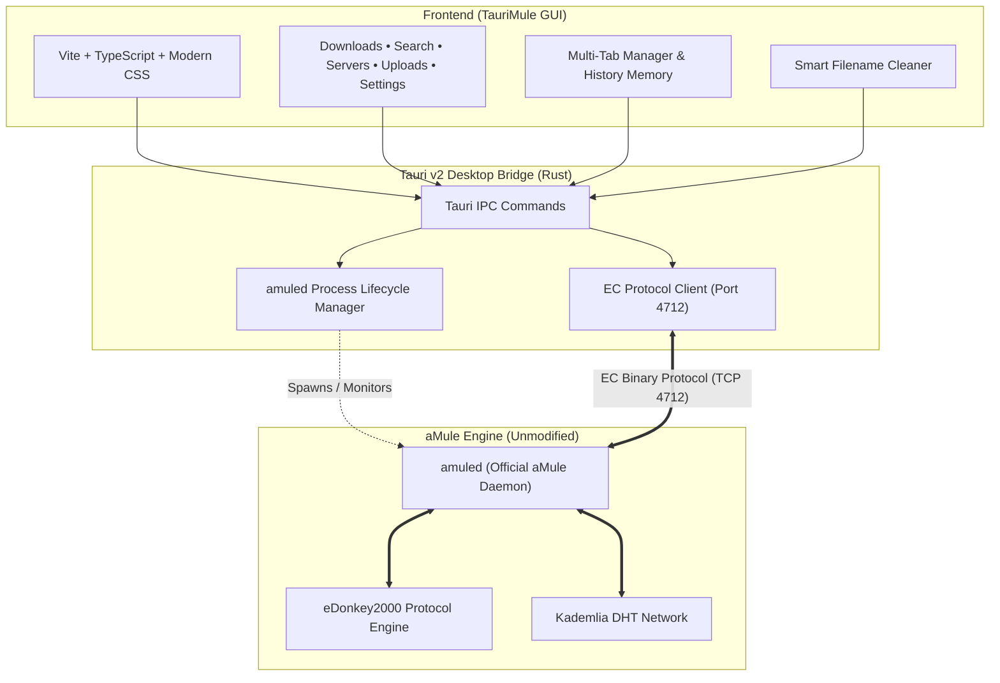

<div align="center">


# ⚡ TauriMule

**Next-Generation Desktop Client for the aMule P2P Daemon**  
*Built with Tauri v2, Rust, TypeScript, and Microsoft Fluent Design*

[](https://www.gnu.org/licenses/gpl-3.0)
[](https://tauri.app/)
[](https://www.rust-lang.org/)
[](https://www.typescriptlang.org/)
[](https://vitejs.dev/)
[](#-internationalization-i18n)
[](https://github.com/alexwing/Taurimule/actions/workflows/release.yml)

[Aviso Legal en Español](#-aviso-legal-y-descargo-de-responsabilidad) • [Legal Disclaimer in English](#-legal-disclaimer--terms-of-use) • [Features](#-key-features) • [Architecture](#-architecture) • [Getting Started](#-getting-started)

</div>

---

> [!WARNING]
> ### 🇪🇸 AVISO LEGAL Y DESCARGO DE RESPONSABILIDAD
> **TauriMule es única y exclusivamente una interfaz gráfica de usuario (GUI / Frontend).**
> - **El motor de red P2P sigue siendo aMule (`amuled`) tal cual**, comunicándose mediante el protocolo estándar de Conexiones Externas (**EC Protocol** en el puerto local 4712).
> - TauriMule y su autor **NO alojan, NO indexan, NO recopilan y NO distribuyen archivos ni contenidos de ningún tipo.**
> - Ni el software ni su desarrollador operan servidores eD2K ni nodos Kad.
> - **El usuario final es el único responsable legal** del contenido que busque, descargue o comparta a través de las redes P2P descentralizadas, debiendo cumplir con la legislación sobre derechos de autor y propiedad intelectual aplicable en su jurisdicción.
> - Consulta el documento completo en [DISCLAIMER.md](DISCLAIMER.md) y los términos de [LICENSE](LICENSE).

> [!WARNING]
> ### 🇬🇧 LEGAL DISCLAIMER & TERMS OF USE
> **TauriMule is strictly an independent Graphical User Interface (GUI / Frontend).**
> - **The underlying P2P network engine remains official aMule (`amuled`) as-is**, communicating through standard **External Connection (EC) protocol** (port 4712).
> - TauriMule and its creator **DO NOT host, index, curate, track, or distribute any digital files or content.**
> - Neither this software nor its repository operates any eD2k servers, Kad nodes, or P2P infrastructure.
> - **The end user assumes sole and full legal responsibility** for any and all search queries, file transfers, or downloads, and must comply with intellectual property laws in their jurisdiction.
> - For full terms and liability limitations, please refer to [DISCLAIMER.md](DISCLAIMER.md) and [LICENSE](LICENSE).

---

## 💡 Concept & Identity

**TauriMule** merges the mythological strength, speed, and safety of the **Taurus** (Tauri v2 + native Rust IPC) with the endurance and alert ears of the **Mule** (eDonkey2000 and Kademlia networks).

It features a **Dynamic Stateful Brand Logo** that reacts in real-time to your network and transfer conditions:

<div align="center">

| 🔵 Connected (High ID) | 🟢 Downloading | 🟡 Warning (Low ID) | ⚫ Idle / Standby |
| :---: | :---: | :---: | :---: |
| <br><sub>**High ID / Server**</sub> | <br><sub>**Active Transfer**</sub> | <br><sub>**Kad Firewalled**</sub> | <br><sub>**Disconnected**</sub> |

</div>

---

## ✨ Key Features

### 1. ⬇️ Enhanced Downloads Queue & Toggle Switch
- **Real-Time Bandwidth**: Live download/upload speed counters, ETA, and progress bar with gradient fills.
- **Fluent WinUI 3 Toggle Switch**: Seamlessly show or hide completed downloads.
  - **Hidden by default** to keep your active workspace uncluttered.
  - Live count indicator: `Ocultar descargados (70)`.
  - Remembers your preference persistently via `localStorage`.
- **Full Column Sorting**: Sort by filename, total size, progress %, transfer speed, or sources count.
- **Direct File Launcher & Folder Explorer**: Double-click or right-click to open completed videos/files in Windows default player or view in File Explorer.

### 2. 🔍 Multi-Tab P2P Search
- **Dedicated Tabs per Search**: Each query opens its own **independent tab** in the results bar with its own result set and live counter.
- **Browse Without Losing Results**: Switch between searches ("Matrix", "Stuart", "Ubuntu") without re-querying the network or losing previous findings.
- **Individual Tab Close**: Close individual tabs (`✕`) without affecting remaining searches.
- **Network Filters**: Search across **Global eD2k**, decentralized **Kad Network**, or **Local Server**, filtered by Video, Audio, Program, Archive, or Document.

### 3. ⏱️ Search History Memory with Individual Deletion
- Remembers your recent searches as interactive chips.
- **Individual Memory Deletion**: Each chip includes a dedicated `✕` button to remove that specific entry from memory without executing the search.
- Click any search chip to re-open its tab and inspect results.
- Includes a quick `Clear All History` option.

### 4. 🧹 Smart Filename Cleaner
- Automatically detects and removes scene metadata, resolutions (`1080p`, `4K`, `HEVC`, `x265`), release groups, and bracketed noise.
- Visual side-by-side **Diff Preview** showing exactly what characters will be stripped before downloading.
- Apply clean renaming to already completed or pending downloads directly inside aMule.

### 5. 🔗 Batch eD2k Link Parser & Downloader
- Paste single or batch `ed2k://|file|...|/` links in one prompt.
- Calculates total batch size and allows individual or bulk clean downloading.
- Automatically handles Spanish accented titles and unclosed metadata tags.

### 6. 🌐 Network Identity & Servers
- Live detection of **High ID / Low ID** and Kad connection state (Open vs Firewalled).
- View all servers with user and file index statistics.
- Connect or disconnect from eD2K servers with a single click.

### 7. 🌍 Internationalization (i18n)
Full live translation without restarting the app:
- 🇪🇸 **Español**
- 🇬🇧 **English**
- 🇫🇷 **Français**
- 🇩🇪 **Deutsch**

---

## 🏛 Architecture



---

## 🚀 Getting Started

### Prerequisites
- [Node.js](https://nodejs.org/) (v18 or higher) & `npm`
- [Rust](https://rustup.rs/) (latest stable toolchain)
- Windows 10/11, Linux, or macOS

### Clone & Install
```bash
git clone https://github.com/alexwing/Taurimule.git
cd Taurimule
npm install
```

### Running in Development Mode
```bash
npm run tauri dev
```

### Building for Production
```bash
npm run tauri build
```
The compiled standalone binary and installer will be generated in `src-tauri/target/release/bundle/`.

---

## 📂 Project Structure

```
Taurimule/
├── public/                  # Static assets & icons
├── src/
│   ├── lib/
│   │   ├── context-menu.ts  # Windows Fluent context menu
│   │   ├── filename-cleaner.ts # Smart regex cleaning & diff engine
│   │   ├── i18n/            # Translations (en, es, fr, de)
│   │   ├── logo.ts          # Dynamic SVG stateful brand logo
│   │   ├── tauri-bridge.ts  # Typed Rust IPC bridge
│   │   └── theme.ts         # Fluent dark/light theme manager
│   ├── styles/
│   │   └── global.css       # Fluent WinUI 3 CSS design system
│   ├── index.html           # SPA entrypoint
│   └── main.ts              # Core router, tabs manager & UI controllers
├── src-tauri/
│   ├── binaries/            # amuled sidecar binary
│   ├── src/
│   │   ├── commands/        # Tauri IPC commands (downloads, search, servers, etc.)
│   │   ├── ec_client/       # aMule External Connection (EC) protocol implementation
│   │   ├── sidecar_manager.rs # amuled process supervisor
│   │   ├── emule_config.rs  # Windows eMule configuration parser
│   │   └── lib.rs           # Tauri plugin registration & runtime setup
│   ├── tauri.conf.json      # Tauri v2 configuration
│   └── Cargo.toml           # Rust dependencies
├── DISCLAIMER.md            # Comprehensive legal disclaimer
├── LICENSE                  # GNU General Public License v3.0
└── README.md                # Project documentation
```

---

## 📜 License & Legal Notice

- **TauriMule UI & Bridge**: Distributed under the terms of the **GNU General Public License v3.0** ([LICENSE](LICENSE)).
- **aMule Daemon**: The aMule daemon is distributed under the GNU GPL v2+.
- **Disclaimer**: This software is provided as-is without any warranties. Please read [DISCLAIMER.md](DISCLAIMER.md) for full legal disclaimers regarding third-party network usage and copyright liability.

---

<div align="center">
Developed with ❤️ by <a href="https://github.com/alexwing">alexwing</a>
</div>
